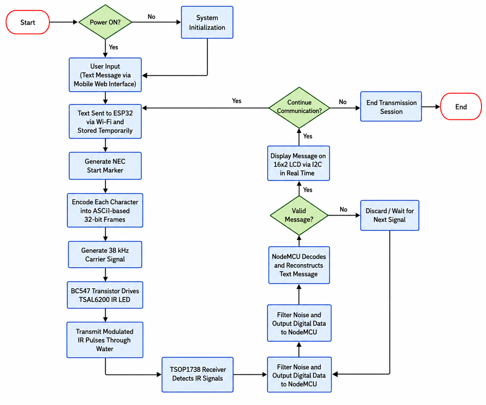
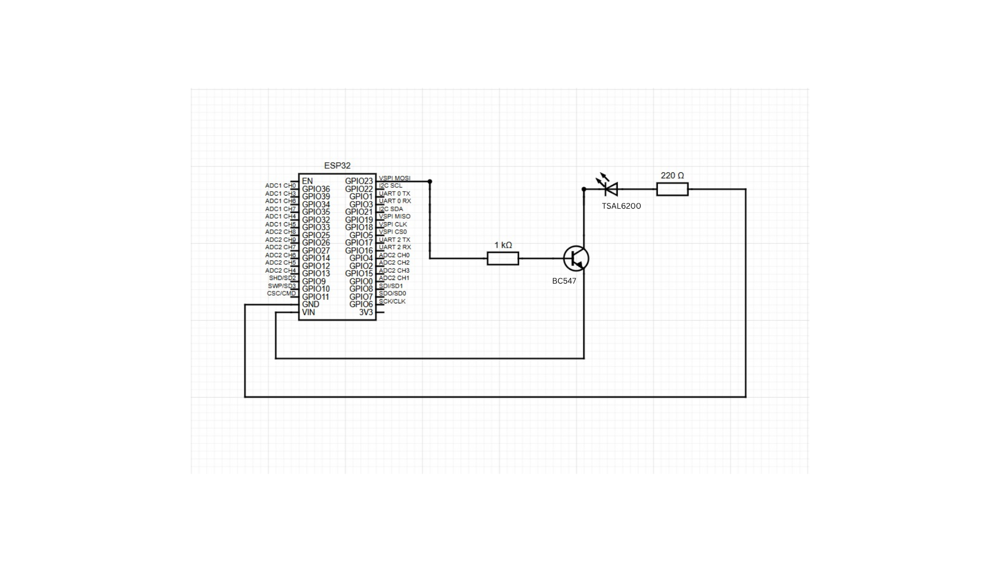
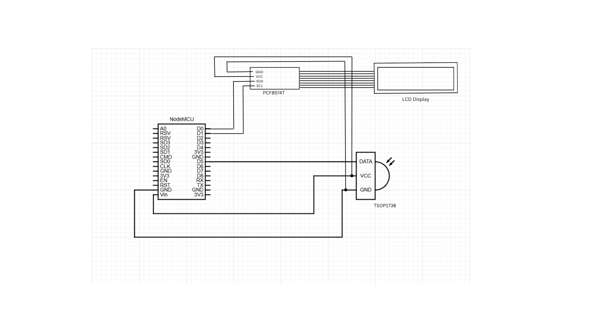

### Underwater IR Communication System

 - System works in line-of-sight; preferebly controlled environments with less disturbance (still water over moving/flowing water).
 - Limited to short ranges (in order of cm) - .
 

#### Transmitter section 
- ESP32 (Wi-Fi input)
- 5V supply, 1 kΩ & 220 Ω resistors
- BC547 driver, 
- TSAL6200 IR LED

#### Receiver section 
- NodeMCU (ESP8266)
- TSOP1738 IR sensor
- 16×2 LCD

#### Data Flow Process

#### Circuit Diagrams

